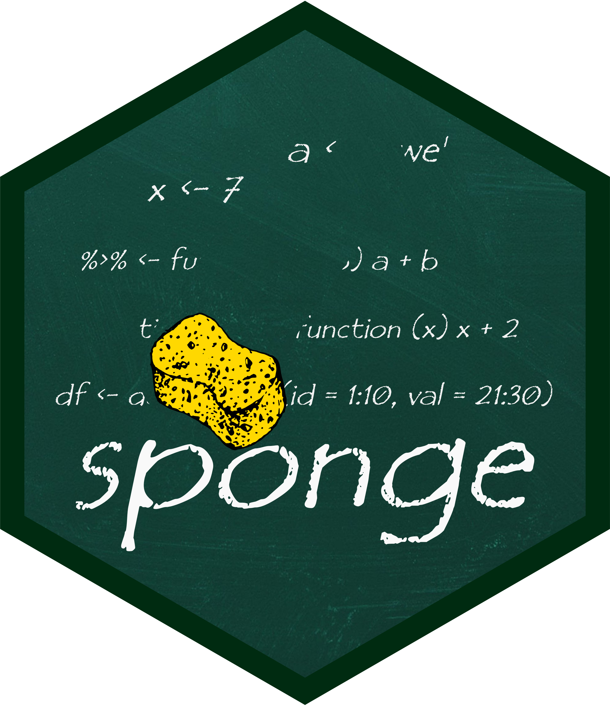

<!-- README.md is generated from README.Rmd. Please edit that file -->

```{r, include = FALSE}
knitr::opts_chunk$set(
  collapse = TRUE,
  comment = "#>",
  fig.path = "man/figures/README-",
  out.width = "100%"
)
```

# sponge 

> Keep your environment clean


<!-- badges: start -->
[](http://krzjoa.github.io/sponge)
[](https://www.redbubble.com/people/krzjoa/works/44569100-sponge-r-package-hex?asc=u&kind=sticker&p=sticker&size=small)
<!-- badges: end -->

A small utility which makes selective objects removing easier.

## Installation

``` r
# install.packages("devtools")
devtools::install_github("krzjoa/sponge")
```


