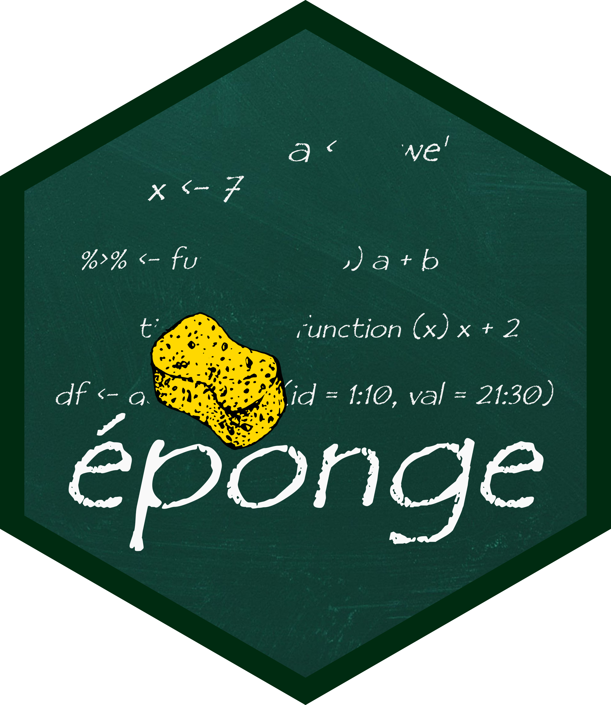

<!-- README.md is generated from README.Rmd. Please edit that file -->

# sponge 

> Keep your environment clean

<!-- badges: start -->

<!-- badges: end -->

The goal of sponge is to …

## Installation

``` r
# install.packages("devtools")
devtools::install_github("krzjoa/sponge")
```
